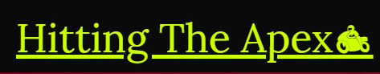

# Hitting The Apex
# Goal for project
The Purpose of Hitting The Apex is to created a website that caters to the needs of fans of Moto GP.
The website will demonstrate easy digestable inforamtion to quickly cath up on the going ons of the current season, that current fans will be able to quickly catch up on and also will be easily understanble for newer fans of Moto Gp. The Website will give inforamtion on the current 2022 championship. The site will also give user the option to sign up to the weekly newsletter, so they can make contact with the website on a weekly basis.  

# Ux

## User Goals
* Accessible up to date inforamtion on the championship
* Aesthetic pleasing images
* Easily Navigatable table for championship
* Simple user interface
* Form to sign up for the newsletter

## User Stories

* As a user, I want the website to be easily navigable.
* As a user, I want the website to give me inforamtion on the current Moto GP Championship.
* As a user, I want to know the upcoming races.
* As a user, I want to know who is leading the championship.
* As a user, I want to know who is competing in the championship and the team they are a part of.
* As a user, I want to know who has place on the podium on the last races.
* As a user, I want to easily navigate through the website.
* As a user, I want to know if the website has soical media and where to access it
* As a user, I want to  know the points scored on all races for each rider. 

## Site Owner Goals
* Promote the sport of moto racing.
* Increase the fanbase of Moto gp.
* To encourage user to sign up for the newsletter.
* Increase rankings on seach engines.
* To have the website updated on the lastest race.
* To keep building on the Website in other area of motosports in the future.

### Requirements

* An easy flowing user interface that is usable on different screen sizes.
* Concise up to date information on all the section of the website.
* Aesthetic pleasing structure of the website so user don't feel lost.

### Expections

* I expect all information is up to date and correct.
* I expect all navigation links to link to the correct part of the website.
* I expect all social media links to work correctly and to a new tab but staying on Hitting The Apex.
* I expect Newsletter submission are post to the correct database.
* I expect the website to be visually appeasing on all screeen sizes.
* I expect all inforamtion on the website to be relavent to Moto GP.
* I expect the website to be free flowing in nature of  accessibility.

## Design Choices

### Fonts

For my fonts I have used [Google Fonts](https://fonts.google.com/ "Google Fonts") to search for a font that would suit the aesthetic of my website. From my search, I have decide to use two font styles. The first font is called [Lora](https://fonts.google.com/specimen/Lora?query=Lora). This font is for the main font for all content inforamtion. Reasons for using this font are it been not to stylised and having a simple readable decor. The second font is called [Arvo](https://fonts.google.com/specimen/Arvo?query=arvo). This font is for all the headers and navigation bar. Reasons for using this font are having a differential style to Lora, so it can stand from the main content although it can compliment to it as well.

### Icons

I have use Icons from [Font Awesome Library](https://fontawesome.com/[) and [Flagicons](https://flagicons.lipis.dev/). The icons from Font Awesome are more for visual reprensation of socail media links and decor to resemble visual style for differrnt part of content ie flag, trophy and medals. The icons used from Flagicons will be more widely use throught the website for the purpose of indiacating the nationality of rider and where the team is based. It will also reprents the country where the races are taking place in.

### Colors 

I used [Encycolorpedia](https://encycolorpedia.com/) to pick out colors for my website. The main color I used throught the website was electric lime #ccff00 a color that is synonymous to fans of Moto GP that represent the color of Valentino Rossi leather's and bike fairings. To complement this color I used jet black #0A0A0A which scores a high contrast ratio on [Webaim](https://webaim.org/resources/contrastchecker/?fcolor=CCFF00&bcolor=0A0A0A). Using these two colors that work in function in reverse of foreground and background the user will not have diffcult experience of viewing the inforamtion of the website. I used blue lightning #3393FF for hover effect on the navigation bar, the tables, the social inks and the submit button. It was also implement on borders to distinguise different section of content. All of the rest of the colors that I used were to represnt the podium posistion for 1st(gold #D4AF37), 2nd(silver #C0C0C0), 3rd(bronze #cd7f32) and retired(violet #EE82EE)

### Stucture

I built my website by desktop size first and then downsized it to the smallest screen size of a Samsung Galaxy Fold (280px) 

|Screen Size  | Breakpoint |
|-------------|------------|
|x-small      |  420px     |
|small        |  570px     |
|large        |  1330px    |
|x-large      |  1548px    |
|x-x-large    |  1770px    |

# Wireframe

# Features

## Existing Features

### Navigation Bar

The navigation bar is implement with logo on the left side which will lead the user back to the top of the page when clicked. The links to each section on the right side that smoothly scroll to each section. The header section is in postion sticky for the use of having the navigation to scoll with movement through the site.

* Desktop

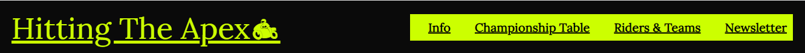

Example of the finished navigation bar with logo, four links.

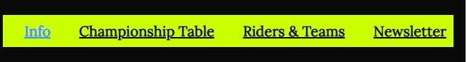

Example of the hover effect in practice for visual impaired user.

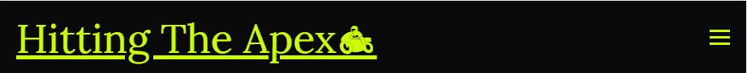

Example of the Hamburger Menu Icon when the screen is sized down for tablet.

Mobile Devices

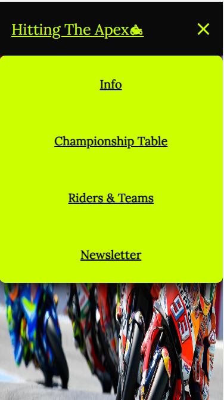

Example of Hamburger Menu opened when clicked on a mobile device.

### Landing Page

The website opens to a large image to indicated to the user that it is a site for motocyling racing. There is welcome box giving detail of inforamtion that can be gather from the site and a link to encourage user to sign up for the newsletter. 

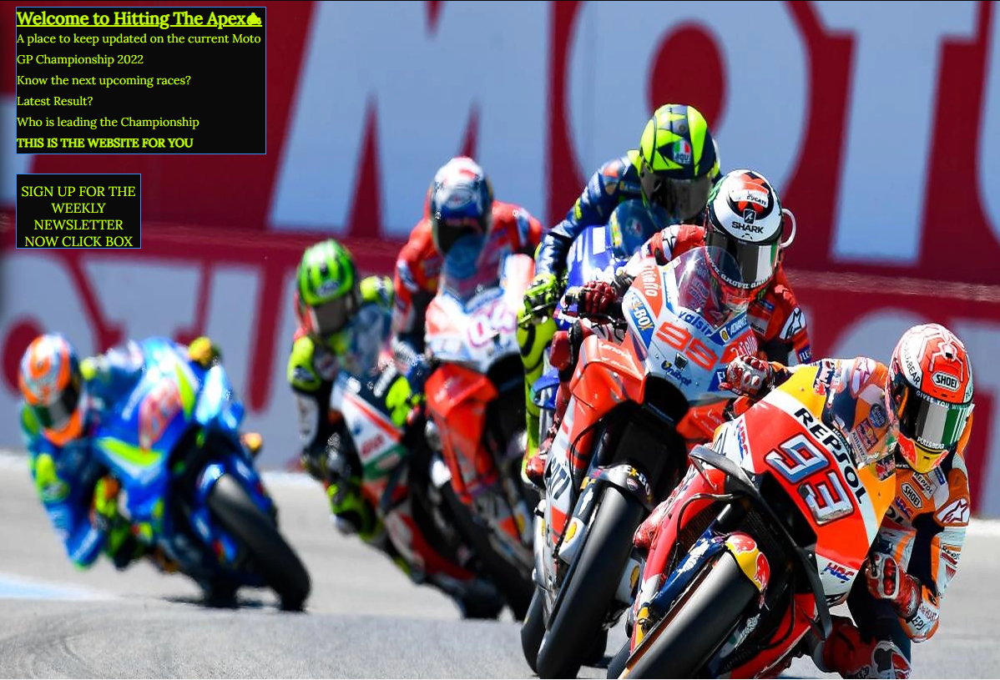

Example of the landing page on a mobile device

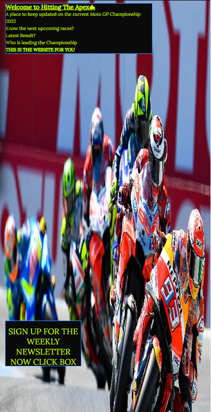

### Info 

The info has three area of content, upcoming races, championship leader and latest result.

The First area upcoming races will showcase all remaining races of the championship season. An images will be partnered with this section showing the track of the next races. Inforamtion showing is date of race, country of races and name of the track.   

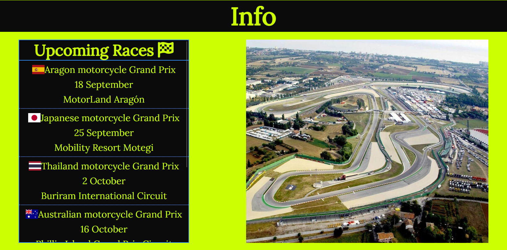

The second area championship leader will show the 1st 2nd and 3rd riders that are leading the championship. An image of the Moto GP will be partnered with this section. Inforamtion showing in this section are image of rider, name of rider, bike that they ride and points total. 

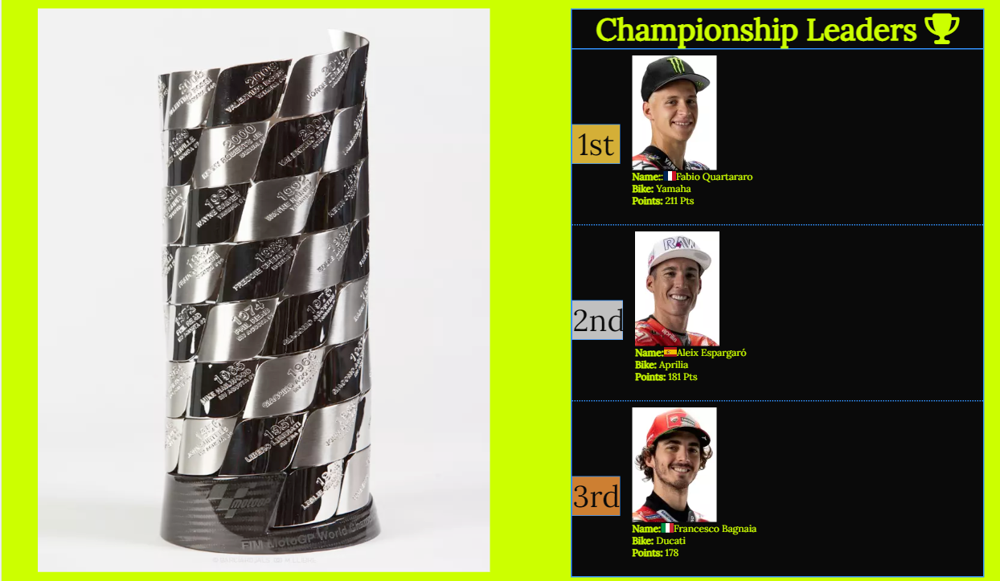

The final area latest result will give inforamtion of the last races that was competed. An video will be showcase beside this area to show highlights of the race. Inforamtion showing in this section will include podium posistion, name of rider and bike of rider.

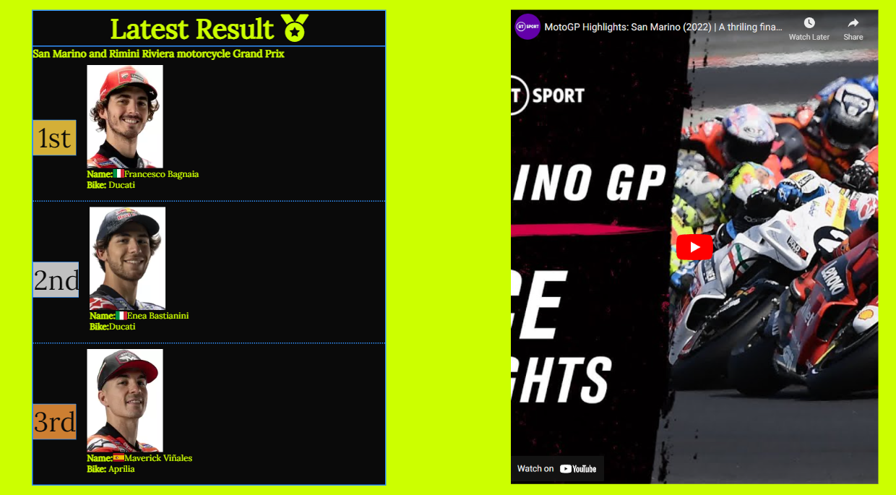

### Tables

The table section gives an detail account of the rider championship table and the constructor championship. The rider table will give information on all riders and how many points were scored in each races. All points will totaled to determine their place in the table. Colors of gold, silver and bronze will determine podium place and violet will mean retired(did not finish races). P and F will also partner the rider placement who accomplish the requirment.  An annotation table will give meaning to pole position, fastest lap and retired. The constructor table will demostrated the same function of the rider except it been for the manufactors. A hover effect can be use on the table to highlight the row that is being viewed for ease of tracking the inforamtion.      

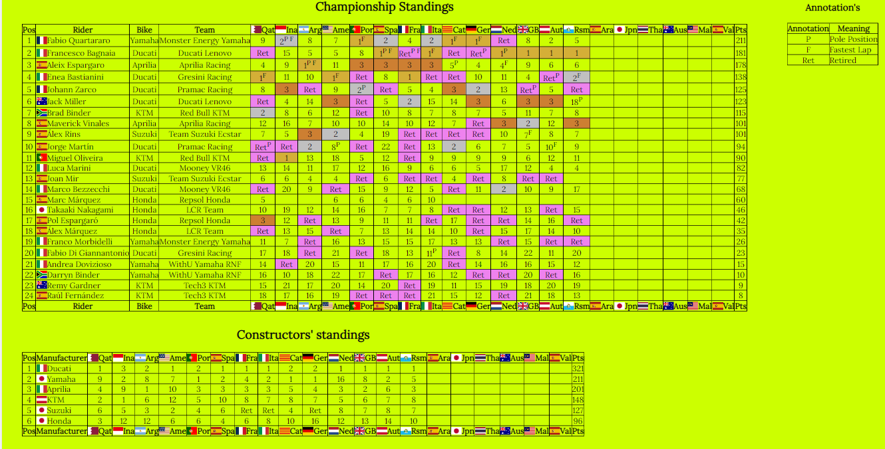

Table at extra extra large (1770px)

Table at extra large switch column (1548px)

At lower screen size (970px) a scroll function will be place so that the table doesnt shrink so the inforamtion doesnt become unviewable.

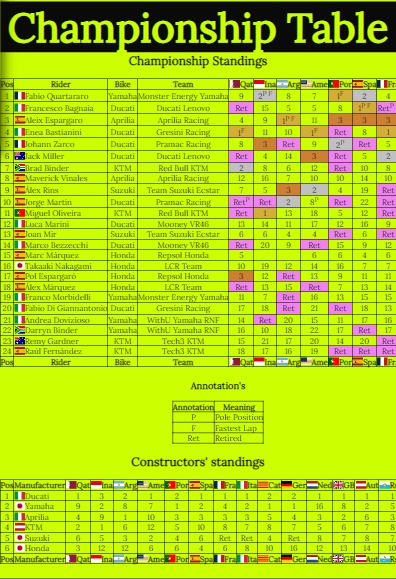

### Rider and Team

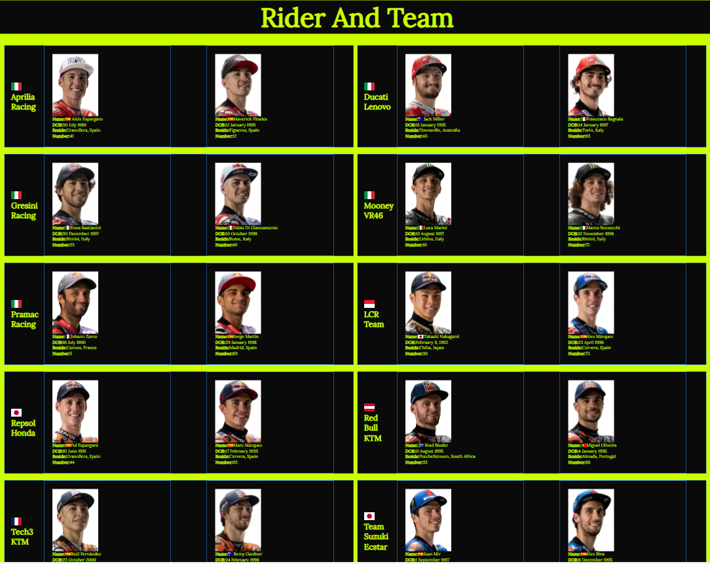

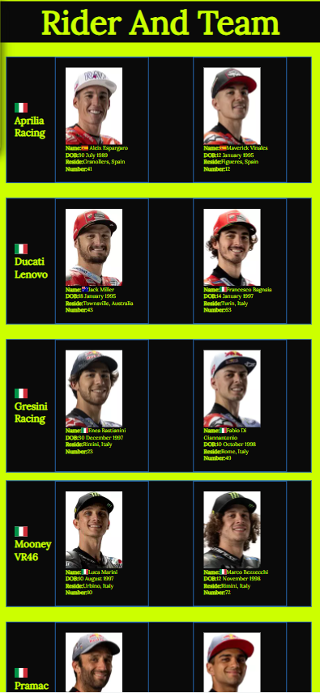

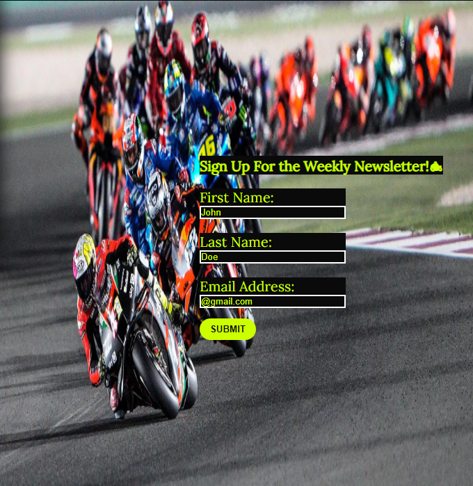

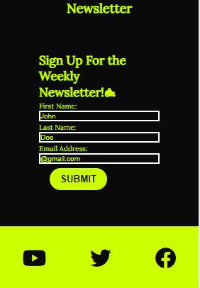

## Features to Be Added

+ Make the table more responsive by adding collapsible colums and rows.
+ Archiving table's to a section for when a new season start so user can can look back on past season.
+ Add a shop to sell merchandise linked to the website.
+ To add columnist to write opinion pieces that can be implemented to a blog section.
+ A gallery section of photes taking at races.

## Languages
* [HTML](https://www.w3schools.com/html/ "HTML")
* [CSS](https://www.w3schools.com/css/ "CSS")
* [JavaScript](https://www.w3schools.com/js/default.asp "JS")

## Libraries and Framework
* [Google Fonts](https://fonts.google.com/ "Google Fonts")
* [Font Awesome library](https://fontawesome.com/ "Font Awesome")
* [Flagicons](https://flagicons.lipis.dev/ "Flagicons")

## Tools
* * [Gitpod](https://www.gitpod.io/ "Gitpod")
* [Encycolorpedia](https://encycolorpedia.com/ "Encycolorpedia")
* [iLoveIMG](https://www.iloveimg.com/ "iLoveImg")
* [WebAim](https://webaim.org/ "WebAim")
* [picresize](https://picresize.com/ "picresize")
* [Google Fonts](https://fonts.google.com/ "Google Fonts")
* [Font Awesome library](https://fontawesome.com/ "Font Awesome")
* [Flagicons](https://flagicons.lipis.dev/ "Flagicons")
* [Balsamic](https://balsamiq.com/wireframes/ "Balsamic")
* [W3C HTML Validation Service](https://validator.w3.org/ "W3C HTML")
* [W3C CSS Validation Service](https://jigsaw.w3.org/css-validator/ "W3C CSS")

# Testing

From testing the site, overall I feel the goal that I set out were met. The site is responsive to small devices(Galaxy fold, Iphone), medium devices (Ipad, Galaxy Tab), large devices(laptop, desktop.). Images size appropriately to the screen sizes staying in it aspect ratio and looking clear. Section stay center through responsive with layout staying consistent. The inforamtion is up to date and resembles the needs of the user.

Problem's that I experience during testing.

I had to add an extra media query of max-width 1770px to fix an issues of the annotaion table not staying inline with constructor table that would happen when the screen width  went below 1770px.

I added grid posistion to my form content for better reponsive after testing with standard box model wasnt effiecent enough.

Visaul aid will be demonstrated in  the wireframe Balsamiq
Details will include upcoming races, current standing in the championship, latest results, riders and team info and sign up for a news letter.
The website will potentialy have 3 pages. 
All pages will have an nav bar that will link to the Home, Rider and Team and gallery. A Logo for the website will be created using https://www.wix.com/.
The purpose of the nav bar is to have easy access throughout the website.
Main page (Home) will have a section on remaining races of the season, current 1st, 2nd and 3rd, in champiomship and the latest result.
The purpose of this section is to give the user the most important detail of the Moto GP championship at first glance for when they enter the website. Upcoming races content will showcase the remaining races of the season with visual aid of the track, date of race, location and name of track. The next content will showcase the current leaders of the season. 1st 2nd and 3rd will be showing with visual aid of the rider. Name of rider, bike and points total will also be included. The last content will show the result of the last result. It demostrates the same of current leader content except the point total.
The next section shows the table's for the riders championship, manufacturer championship and a annotation table. The rider championship table gives inforamtion on all riders competing in the season showing all their race result, championship points, current position and the team manufacturer. The manufacturer table demonstrate all the same criteria of the rider championship except it will show the hightest earned position of said manufacturer of an race to tally up who will be leading the manufacturer championship. An annotaion table details the shorthand of fastest lap, pole position and retired.
   form image source aprilla.com