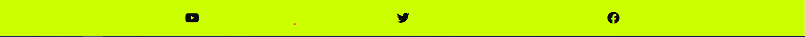
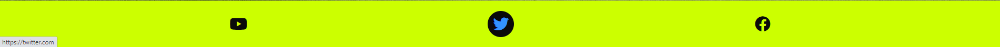

# Hitting The Apex
# Goal for project
The Purpose of Hitting The Apex is to creat a website that caters to the needs of fans of Moto GP.
The website will demonstrate easily digestible information to quickly catch up on the going on of the current season, which current fans will be able to quickly catch up on and also will be easily understandable for newer fans of Moto Gp. The Website will give information on the current 2022 championship. The site will also give the user an option to sign up for the weekly newsletter, so they can make contact with the website weekly.

# Table of Contents
* [UX](#ux "UX")
    * [User Goals](#user-goals "User Goals")
    * [User Stories](#user-stories "User Stories")
    * [Site Owner Goals](#site-owner-goals)
    * [User Requirements and Expectations](#user-requirements-and-expectations)
         * [Requirements](#requirements)
         * [Expectations](#expectations)
     * [Design Choices](#design-choices)
        * [Fonts](#fonts)
        * [Icons](#icons)
        * [Colors](#colors)
        * [Structure](#structure)
    * [Wireframes](#wireframes)
    * [Features](#features)
        * [Existing Features](#existing-features)
            * [Navigation Bar](#navigation-bar)
            * [Landing Page](#landing-page)
            * [Info](#info)
            * [Tables](#tables)
            * [Rider and Team](#rider-and-team)
            * [Sign UP](#sign-up)
            * [Footer](#footer)
        * [Features To Be added](#features-to-be-added)
    * [Technologies used](#technologies-used)
        * [Languages](#languages)
        * [Tools and Libraries](#tools-and-libraries)
    * [Testing](#testing)
        * [Unfixed Bugs](#unfixed-bugs)
    * [Deployment](#deployment)
    * [Credits](#credits)

# Ux

## User Goals
* Accessible up to date information on the championship
* Aesthetic pleasing images
* Easily Navigatable table for championship
* Simple user interface
* Form to sign up for the newsletter

## User Stories

* As a user, I want the website to be easily navigable.
* As a user, I want the website to give me details on the current Moto GP Championship.
* As a user, I want to know about the upcoming races.
* As a user, I want to know who is leading the championship.
* As a user, I want to know who is competing in the championship and the team they are a part of.
* As a user, I want to know who has placed on the podium in the last races.
* As a user, I want to easily navigate through the website.
* As a user, I want to know if the website has social media and where to access it
* As a user, I want to  know the points scored in all races for each rider. 

## Site Owner Goals
* Promote the sport of moto racing.
* Increase the fanbase of Moto GP.
* To encourage the user to sign up for the newsletter.
* Increase rankings on search engines.
* To have the website updated on the latest race.
* To keep building on the Website in other areas of motorsports in the future.

## User Requirements and Expectations

### Requirements

* An easy flowing user interface that is usable on different screen sizes.
* Concise up to date information on all the sections of the website.
* Aesthetic pleasing structure of the website so users don't feel lost.

### Expectations

* I expect all information is up to date and correct.
* I expect all navigation links to link to the correct part of the website.
* I expect all social media links to work correctly and to a new tab but stay on Hitting The Apex.
* I expect Newsletter submissions are posted to the correct database.
* I expect the website to be visually appealing on all screen sizes.
* I expect all information on the website to be relevant to Moto GP.
* I expect the website to be free flowing in the nature of accessibility.

\
&nbsp;
[Back to Top](#table-of-contents)
\
&nbsp;

## Design Choices

### Fonts

For my fonts, I have used [Google Fonts](https://fonts.google.com/ "Google Fonts") to search for a font that would suit the aesthetic of my website. From my search, I have decided to use two font styles. The first font is called [Lora](https://fonts.google.com/specimen/Lora?query=Lora). This font is for the main font for all content information. The reasons for using this font are it has been not too stylized  and has a simple readable decor. The second font is called [Arvo](https://fonts.google.com/specimen/Arvo?query=arvo). This font is for all the headers and navigation bars. Reasons for using this font are having a different style to Lora, so it can stand from the main content although it can complement it as well.

### Icons

I have used Icons from [Font Awesome Library](https://fontawesome.com/[) and [Flagicons](https://flagicons.lipis.dev/). The icons from Font Awesome are more for a visual representation of social media links and decor to resemble visual style for different part of the content ie flag, trophy and medals. The icons used from Flagicons will be more widely used through the website for indicating the nationality of the rider and where the team is based. It will also represent the country where the races are taking place in.

### Colors 

I used [Encycolorpedia](https://encycolorpedia.com/) to pick out colors for my website. The main color I used through  the website was electric lime #ccff00 a color that is synonymous to fans of Moto GP that represent the color of Valentino Rossi leathers  and bike fairings. To complement this color I used jet black #0A0A0A which scores a high contrast ratio on [Webaim](https://webaim.org/resources/contrastchecker/?fcolor=CCFF00&bcolor=0A0A0A). Using these two colors that work in function in reverse of foreground and background the user will not have difficult experience viewing the information of the website. I used blue lightning #3393FF for the hover effect on the navigation bar, the tables, the social inks, and the submit button. It was also implemented on borders to distinguish different sections of content. All of the rest of the colors that I used were to represent the podium positions for 1st(gold #D4AF37), 2nd(silver #C0C0C0), 3rd(bronze #cd7f32) and retired(violet #EE82EE).

### Structure

I built my website by desktop size first and then downsized it to the smallest screen size of a Samsung Galaxy Fold (280px) 

|Screen Size  | Breakpoint |
|-------------|------------|
|x-small      |  420px     |
|small        |  610px     |
|medium       |  800px     |
|large        |  970px     |
|x-large      |  1330px    |
|x-x-large    |  1548px    |

\
&nbsp;
[Back to Top](#table-of-contents)
\
&nbsp;

# Wireframes

I used Balsamic to create wireframes for my Website. I design wireframes for desktop design, tablet design ,and mobile design. Each wireframe is linked below.

### [Desktop Wireframe](wireframe/hitting%20the%20apex%20Desktop.bmpr)
### [Tablet Wireframe](wireframe/hitting%20the%20apex%20Tablet.bmpr)
### [Mobile Wireframe](wireframe/hitting%20the%20apex%20mobile.bmpr)

\
&nbsp;
[Back to Top](#table-of-contents)
\
&nbsp;

# Features

## Existing Features

### Navigation Bar

The navigation bar is implemented with a logo on the left side which will lead the user back to the top of the page when clicked. The links to each section on the right side smoothly scroll to each section. The header section is in position sticky for the use of having the navigation to scroll with movement through the site.

* Desktop

Example of the finished navigation bar with logo, and four links.

Example of the hover effect in practice for the visually impaired user.

Example of the Hamburger Menu Icon when the screen is sized down for tablet.

Example of Hamburger Menu opened when clicked on a mobile device.

\
&nbsp;
[Back to Top](#table-of-contents)
\
&nbsp;

### Landing Page

The website opens to a large image to indicate to the user that it is a site for motorcycling racing. There is a welcome box giving detail of information that can be gathered from the site and a link to encourage the user to sign up for the newsletter. 

Example of the landing page on a mobile device

\
&nbsp;
[Back to Top](#table-of-contents)
\
&nbsp;

### Info 

The info has three areas of content, upcoming races, championship leaders, and the latest result.

The First area upcoming races will showcase all remaining races of the championship season. Images will be partnered with this section showing the track of the next races. Information showing is the date of the race, country of race and name of the track.   

The second area championship leader will show the 1st 2nd and 3rd riders that are leading the championship. An image of the Moto GP will be partnered with this section. The information shown in this section is the image of the rider, the name of the rider, the bike that they ride, and points total. 

The final area's latest result will give information on the last races that were competed. A video will be showcased beside this area to show highlights of the race. The information shown in this section will include podium position, name of rider, and bike of rider.

\
&nbsp;
[Back to Top](#table-of-contents)
\
&nbsp;

### Tables

The table section gives a detailed account of the rider championship table and the constructor championship. The rider table will give information on all riders and how many points were scored in each race. All points will be totaled to determine their place in the table. Colors of gold, silver, and bronze will determine podium place and violet will mean retired(did not finish races). P and F will also partner with the rider placement who accomplish the requirements.  An annotation table will give meaning to pole position, fastest lap, and retired. The constructor table will demonstrate the same function of the rider except it has been for the manufacturers. A hover effect can be used on the table to highlight the row that is being viewed for ease of tracking the information.      

Table at (1770px)

Table at  extra extra large switch column (1548px)

At large screen size (970px) a scroll function will be place so that the table doesnt shrink so the inforamtion doesnt become unviewable.

\
&nbsp;
[Back to Top](#table-of-contents)
\
&nbsp;

### Rider and Team

The rider and team section will give the user information on all the riders participating in the championship. It will detail the team that the rider is a part of, give a brief detail on the rider, and an image of the rider.

The rider and team section on tablet screen (1548px)

The rider and team section on mobile screen (610px)

### Sign UP

The Newsletter section will allow the user to interact with the website. The user can enter their detail to sign up for a weekly newsletter to stay up to date with the content of the site.  

Newsletter section on tablet (970px) with the background made transparent on the form so the background image bleeds through.

Newsletter section on mobile.(420px)

\
&nbsp;
[Back to Top](#table-of-contents)
\
&nbsp;

### Footer

+ The footer contains social media links relevant to the website

+ The footer hover effect

\
&nbsp;
[Back to Top](#table-of-contents)
\
&nbsp;

## Features to Be Added

+ Make the table more responsive by adding collapsible colums and rows.
+ Archiving table's to a section for when a new season start so user can can look back on past season.
+ Add a shop to sell merchandise linked to the website.
+ To add columnist to write opinion pieces that can be implemented to a blog section.
+ A gallery section of photes taking at races.

# Technologies used

## Languages
* [HTML](https://www.w3schools.com/html/ "HTML")
* [CSS](https://www.w3schools.com/css/ "CSS")
* [JavaScript](https://www.w3schools.com/js/default.asp "JS")

## Libraries and Framework
* [Google Fonts](https://fonts.google.com/ "Google Fonts")
* [Font Awesome library](https://fontawesome.com/ "Font Awesome")
* [Flagicons](https://flagicons.lipis.dev/ "Flagicons")

## Tools
*  [Gitpod](https://www.gitpod.io/ "Gitpod")
* [Encycolorpedia](https://encycolorpedia.com/ "Encycolorpedia")
* [iLoveIMG](https://www.iloveimg.com/ "iLoveImg")
* [WebAim](https://webaim.org/ "WebAim")
* [picresize](https://picresize.com/ "picresize")
* [Google Fonts](https://fonts.google.com/ "Google Fonts")
* [Font Awesome library](https://fontawesome.com/ "Font Awesome")
* [Flagicons](https://flagicons.lipis.dev/ "Flagicons")
* [Balsamic](https://balsamiq.com/wireframes/ "Balsamic")
* [W3C HTML Validation Service](https://validator.w3.org/ "W3C HTML")
* [W3C CSS Validation Service](https://jigsaw.w3.org/css-validator/ "W3C CSS")

\
&nbsp;
[Back to Top](#table-of-contents)
\
&nbsp;

# Testing

From testing the site, overall I feel the goal that I set out was met. The site is responsive to small devices(Galaxy fold, iPhone), medium devices (Ipad, Galaxy Tab), and large devices(laptop, desktop.). Images size appropriately to the screen sizes staying in their aspect ratio and looking clear. Section stays center through responsive with layout staying consistent. The information is up to date and resembles the needs of the user.

The problems that I experience during testing.

+ I had to add an extra media query of max-width 1770px to fix issues of the annotation table not staying in line with the constructor table that would happen when the screen width went below 1770px.

+ I added grid position to my form content for better reponsive after testing with the standard box model wasn't efficient enough.

+ I restructured my main content's flex from originally being flex-wrap on a larger screen to changing it to a grid and column flex hybrid. I used flew wrap on rows and flex-basis on the column so it would be better responsive on a larger screen. It would switch to the column on a smaller screen with a media query. This was also implemented in the rider section.

+ At first, during testing, I taught the table was responsive when sized but with further inspection, it was not. To fix the problem I added a scroll to the rider championship table and the constructor table.

+  When deploying my site to GitHub pages, I encountered the problem of my stylesheet not linking to my Html. The problem occurred from my assets folder being capitalized. I first change the "a" to uppercase so It would link, but sticking to the industry standard of having the directory in lowercase. I use the git command of git mv case-sensitive tmp,git mv tmp CaseSensitive to fix the problem.

+ Error's I encountered when I ran my HTML through validator w3 was using the <bold> element in my <th> element which is by default already a style of the element. Adding px to my width and height img tags, leaving my ACTION in my FORM element empty, and leaving my SRCSET empty in my img tag. To fix this error I deleted all the inappropriate values that were needed. [Result](wireframe/html%20validator.png "W3C HTML") 

+ Error's I encountered when I ran my CSS through validator w3 jigsaw were reorganizing my overflow rule last in the upcoming section, spell checks in my .nav-menu, and deleting a word-break rule that was deprecated. I have 5 warnings for vendor extension. [Result](wireframe/css%20validator.png "W3C CSS")

\
&nbsp;

## Unfixed Bugs 

A bug that I encountered was having a margin on the left or right of a table that was in the scroll. If I had a margin on when the scroll appeared on the lower screen size the table would overflow out of the margin set impending the visual of the start row and the end row. To compromise I turned off the margin left and right for visual structure inconsistency.

\
&nbsp;
[Back to Top](#table-of-contents)
\
&nbsp;

# Deployment

Project was deployed on GitHub using the page feature. Link to https://izzyleech.github.io/hitting-the-apex/"Hitting-the-Apex/

\
&nbsp;
[Back to Top](#table-of-contents)
\
&nbsp;

# Credits

For Code
* [Gaurav](https://dev.to/devggaurav/let-s-build-a-responsive-navbar-and-hamburger-menu-using-html-css-and-javascript-4gci)

For Content
* [Moto GP](https://www.motogp.com/)
* [Aprilia](https://www.aprilia.com/th_TH/aprilia-world/racing/aprilia-motogp-2021-race-gp-doha/)
* [Garciarojals](https://www.garciarojals.com/motogp-champions-tower-replica)
* [BT Sport](https://www.youtube.com/watch?v=vXwmGRtbNMc)

\
[Back to Top](#table-of-contents)
\
&nbsp;